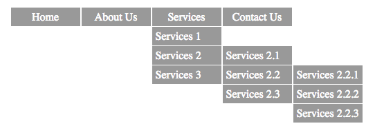

# Horizontal Hierarchical Menu

This is an example of multi level hierarchical jQuery menu

## Demo

 - [menu demo](http://yuliyawebdevelopment.com/demos/hierarchical-menu/)

## Usage

Prepare your HTML

<ul class="h-menu">
	<li><a href="#">Home</a></li>
    <li><a href="#">About Us</a></li>
    <li><a href="#">Services</a>
    	<ul>
        	<li><a href="#">Services 1</a></li>
            <li><a href="#">Services 2</a>
                <ul>
                    <li><a href="#">Services 2.1</a></li>
                    <li><a href="#">Services 2.2</a>
                        <ul>
                            <li><a href="#">Services 2.2.1</a></li>
                            <li><a href="#">Services 2.2.2</a></li>
                            <li><a href="#">Services 2.2.3</a></li>
                        </ul> 
                    
                    </li>
                    <li><a href="#">Services 2.3</a></li>
                </ul> 
            </li>
            <li><a href="#">Services 3</a></li>
       </ul>    
    </li>
    <li><a href="#">Contact Us</a>
        <ul>
        	<li><a href="#">Option 1</a></li>
            <li><a href="#">Option 2</a></li>
            <li><a href="#">Option 3</a></li>  
        </ul>
    </li>  
</ul>

## Options

# Slide speed

$('.h-menu').waSlideMenu({
    slideSpeed: 500
});
By default 300.
